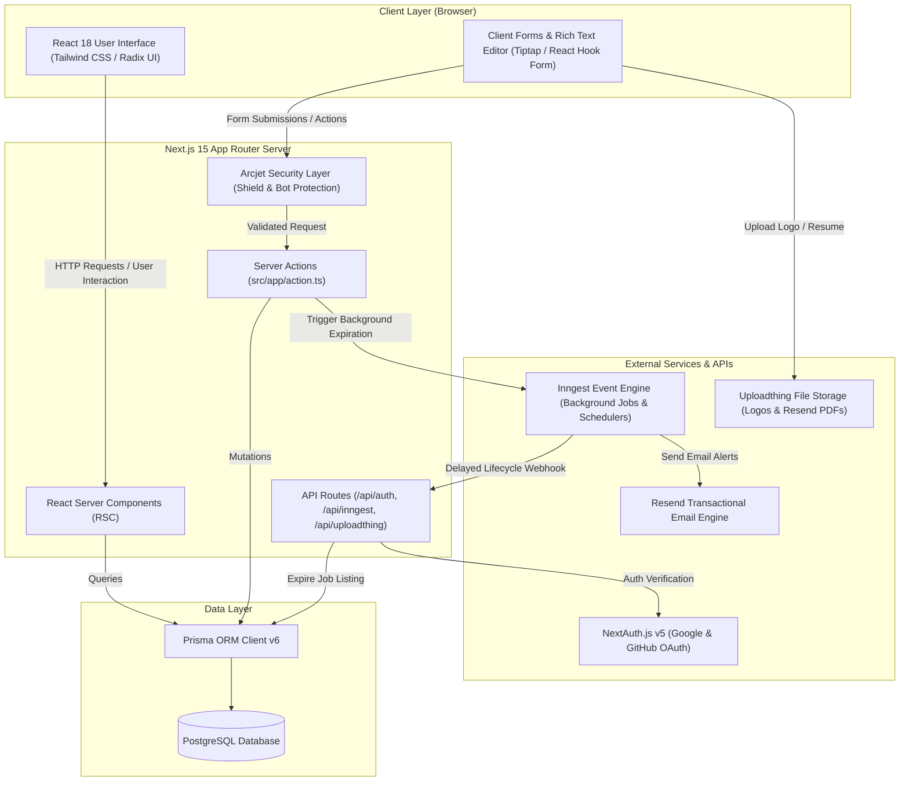

# Technical Architecture Document - Career Wave

## 1. High-Level Architecture Overview

Career Wave is designed as a modern, decoupled full-stack web application leveraging the **Next.js 15 App Router** paradigm. It combines Server Components for high-performance rendering, Server Actions for type-safe data mutations, and specialized third-party services for background job scheduling, security shielding, file hosting, and database persistence.

### High-Level Architecture Diagram



---

## 2. Technology Stack

### 2.1 Core Framework & Runtime
- **Framework**: [Next.js 15 (App Router)](https://nextjs.org/) using React 18, Server Components, and Server Actions.
- **Language**: TypeScript (v5) providing strict static typing across client and server boundaries.
- **Styling**: Tailwind CSS (v3), `tailwindcss-animate`, `@tailwindcss/typography`, and `clsx` / `tailwind-merge`.
- **UI Components**: Radix UI primitives (`@radix-ui/react-*`), Lucide Icons (`lucide-react`), Sonner toast notifications, and `next-themes`.

### 2.2 Data Layer & Database
- **Database**: PostgreSQL relational database.
- **ORM**: [Prisma ORM v6](https://www.prisma.io/) with `@auth/prisma-adapter` for database schema migrations, client generation, and type-safe query building.

### 2.3 Authentication & Authorization
- **Authentication**: NextAuth.js v5 (`next-auth@5.0.0-beta.25`) with Google OAuth and GitHub OAuth providers.
- **Session Management**: Database-backed sessions stored in PostgreSQL `Session` and `Account` tables.
- **User Scoping**: Utility functions (`requireUser`) enforcing authenticated state and role validation (`COMPANY` vs `JOB_SEEKER`).

### 2.4 Background Jobs & Event Workflows
- **Workflows**: [Inngest SDK](https://www.inngest.com/) (`inngest@^3.54.2`).
- **Event Handlers**:
  - `handleJobExpiration`: Schedules delayed job status transition to `EXPIRED` based on listing duration. Listens for cancellation events on job deletion.
  - `sendPeriodicJobListings`: Triggered on candidate onboarding for dispatching active job alerts.

### 2.5 File Management
- **File Uploads**: [Uploadthing](https://uploadthing.com/) (`uploadthing` & `@uploadthing/react`).
- **Use Cases**: Uploading company logos (images) and candidate resumes (PDFs) with strict MIME-type validation.

### 2.6 Security & Bot Shielding
- **Security SDK**: [Arcjet](https://arcjet.com/) (`@arcjet/next`).
- **Protections**: Enforces `shield()` and `detectBot()` rules on all mutating server actions to prevent automated form submissions and abuse.

### 2.7 Content Formatting & Utilities
- **Rich Text Editor**: Tiptap Editor (`@tiptap/react`, `@tiptap/starter-kit`, color, typography, text-align extensions).
- **Form Validation**: React Hook Form with `@hookform/resolvers` and Zod schemas (`zodSchema.ts`).
- **Email Dispatch**: Resend SDK (`resend`).

---

## 3. Detailed Folder & File Structure

```
career-wave/
├── prisma/
│   └── schema.prisma                 # Database models (User, Company, JobSeeker, JobPost, JobApplication, SavedJobPost, Auth models)
├── public/                           # Static assets, logos, and public images
├── scripts/                          # Maintenance and utility scripts
├── src/
│   ├── app/
│   │   ├── (mainLayout)/             # Layout group for authenticated & primary application views
│   │   │   ├── applications/         # Company ATS dashboard for managing candidate applications
│   │   │   ├── favorites/            # Job seeker saved jobs dashboard
│   │   │   ├── job/                  # Public job detail views & application forms
│   │   │   │   └── [jobId]/          # Dynamic route for job details & apply page
│   │   │   ├── jobs/                 # Company edit & manage job route
│   │   │   │   └── [jobId]/edit/     # Dynamic route for editing existing posts
│   │   │   ├── my-applications/      # Job seeker dashboard for tracking application status
│   │   │   ├── my-jobs/              # Company job management view (active/draft/expired posts)
│   │   │   ├── post-job/             # Employer job post creation form
│   │   │   ├── layout.tsx            # Main layout wrapper with Navbar and Footer
│   │   │   └── page.tsx              # Public home/landing page with job search & filters
│   │   ├── api/                      # Serverless API routes
│   │   │   ├── auth/                 # NextAuth route handlers ([...nextauth])
│   │   │   ├── chat/                 # Canned chatbot API route
│   │   │   ├── inngest/              # Inngest background function execution endpoint
│   │   │   └── uploadthing/          # Uploadthing core API route for file uploads
│   │   ├── login/                    # Authentication login page
│   │   ├── onboarding/               # User persona setup page (Company vs JobSeeker)
│   │   ├── utils/                    # Shared utilities and configurations
│   │   │   ├── arcjet.ts             # Arcjet security configuration
│   │   │   ├── auth.ts               # NextAuth setup and helper exports
│   │   │   ├── db.ts                 # Prisma singleton instance
│   │   │   ├── formatCurrency.ts     # Salary formatting helper
│   │   │   ├── formatRelativeTime.tsx# Relative time helper
│   │   │   ├── inngest/              # Inngest client configuration
│   │   │   ├── jobListingDurationPricing.ts # Listing duration pricing calculator
│   │   │   ├── listOfBenefits.tsx    # Available benefit tags dictionary
│   │   │   ├── requireuser.ts        # Server action user authentication check
│   │   │   ├── searchAnalytics.ts    # Search analytics utility
│   │   │   └── zodSchemas.ts         # Zod schemas for form validation
│   │   ├── action.ts                 # Server actions (Job creation, application, status updates, saved jobs)
│   │   ├── globals.css               # Tailwind & root CSS custom properties
│   │   └── layout.tsx                # Root HTML layout with ThemeProvider and Sonner Toaster
│   ├── components/
│   │   ├── forms/                    # Form components
│   │   │   ├── onboarding/           # Company and JobSeeker onboarding forms
│   │   │   ├── createJobForm.tsx     # Job post creation form
│   │   │   ├── EditJobForm.tsx       # Job post editing form
│   │   │   ├── JobApplicationForm.tsx# Candidate application form
│   │   │   └── LoginForm.tsx         # OAuth sign-in form buttons
│   │   ├── general/                  # Application UI widgets & shared components
│   │   │   ├── ApplicationsTable.tsx # ATS applications table with status dropdown & notes modal
│   │   │   ├── ApplyJobButton.tsx    # Job application submission button wrapper
│   │   │   ├── BenefitsSelector.tsx  # Multi-select checkbox grid for job benefits
│   │   │   ├── ChatBot.tsx           # Floating chatbot UI widget
│   │   │   ├── Jobcard.tsx           # Individual job post card component
│   │   │   ├── Jobfilter.tsx         # Search filter sidebar (job type, location, salary)
│   │   │   ├── JobListing.tsx        # Server-rendered job list container
│   │   │   ├── MainPagination.tsx    # Job list page pagination controls
│   │   │   ├── Navbar.tsx            # Header navigation bar with role-based links
│   │   │   ├── SearchBar.tsx         # Main search input with filter selectors
│   │   │   └── UserDropdawn.tsx      # User avatar menu dropdown with logout/dashboard links
│   │   ├── richTextEditor.tsx/       # Tiptap rich text editor implementation
│   │   └── ui/                       # Reusable UI primitives (Button, Card, Input, etc.)
│   └── lib/                          # Classname merger helper (utils.ts)
├── .env                              # Environment variables (DB URL, Auth secret, Arcjet key)
├── next.config.mjs                   # Next.js configuration
├── package.json                      # Node.js dependencies & scripts
├── tailwind.config.ts                # Tailwind CSS design system configuration
└── tsconfig.json                     # TypeScript compiler settings
```
